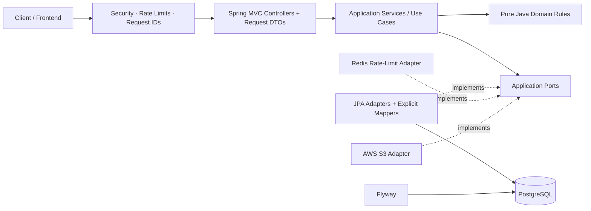
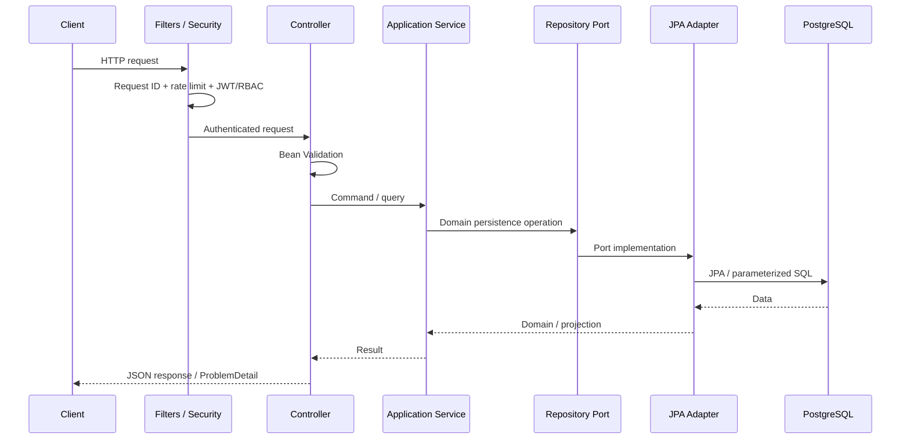
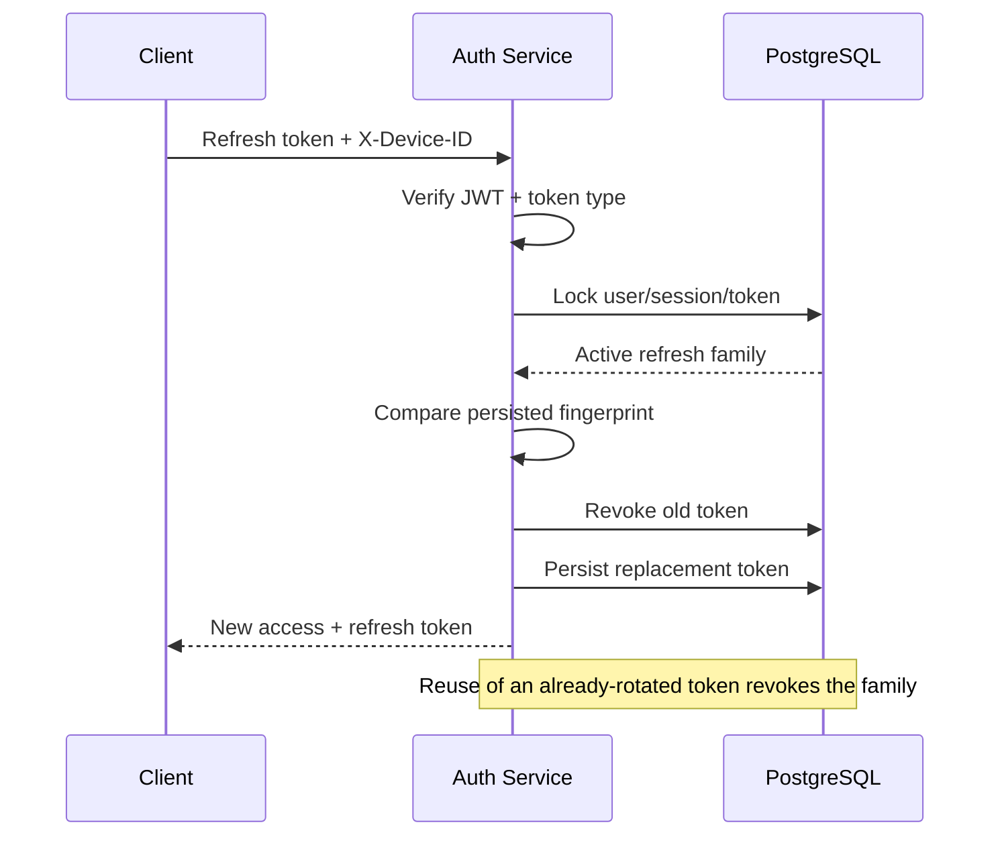
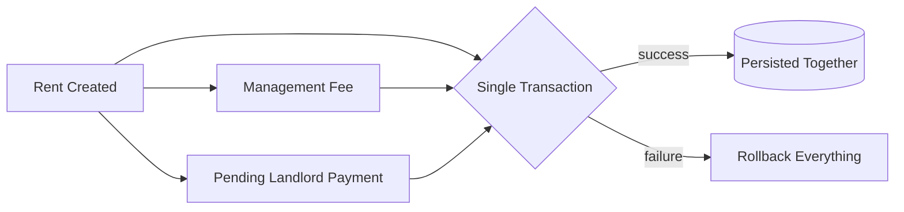

<div align="center">

# Real Estate Management API

### A production-minded Java backend for property operation, tenancy workflows, accounting, secure authentication, and cloud-ready file storage.

Built as an **architectural migration from Express + TypeScript + Prisma to Java 26 + Spring Boot 4**, preserving useful business behavior while strengthening domain boundaries, security, transaction safety, observability, and deployment readiness.

<p>
  
  
  
  
</p>

<p>
  
  
  
  
  
  
</p>

**Modular Monolith · Clean Architecture · Spring Security · JWT Rotation · PostgreSQL · Redis · S3 · Flyway · Testcontainers · Docker · Kubernetes**

[Quick Start](#quick-start) · [Architecture](#architecture) · [Security](#security-model) · [API](#api-spotlight) · [Testing](#testing--verification) · [Operations](#operations--deployment)

</div>

---

## Why this repository is worth exploring

The backend had useful separation through controllers, services, repository abstractions, Prisma adapters, Zod validation, and explicit response mappers. This version keeps that intent while removing reversed dependencies and moving the system toward a production-oriented modular monolith.

The architecture also addresses concrete engineering problems found in the implementation:

* public registration could request an `ADMIN` role;
* an API mapper could expose password hashes;
* public property responses could expose landlord contact/document data;
* user/subtype creation and rent/fee/payment creation were not atomic;
* refresh-token rotation, replay detection, logout invalidation, device-aware sessions, Redis rate limiting, metrics, and cloud storage were missing;
* property updates could remove existing images unexpectedly;
* several accounting update paths could mutate the wrong transaction records;
* money used floating-point storage rather than decimal arithmetic;
* queries and reporting paths could load unbounded datasets.

The Java implementation turns those findings into explicit architectural decisions: **pure domain models, repository ports, persistence adapters, transactional application services, safe API projections, rotating sessions, BigDecimal accounting, bounded reads, Flyway migrations, Redis-backed protection, private S3-compatible storage, metrics, tests, and container deployment assets.**

> **Snapshot:** this repository demonstrates backend architecture, application security, relational data modeling, transaction design, cloud storage, observability, testing, containerization, and migration work—not only REST CRUD.

---

## Core capabilities

### Identity & access

* User, tenant, landlord, and administrator workflows
* BCrypt password hashing
* Short-lived access JWTs
* Device-bound refresh-token rotation
* Refresh replay detection and family revocation
* Logout and password-change invalidation
* Role-based and owner-aware authorization
* Security-version checks for immediate session invalidation

### Property management

* Public property listings and detail views
* Landlord/owner-specific property access
* Address history through current/previous associations
* Multiword location search across address data
* Safe partial updates that preserve omitted fields
* Property images and documents backed by private S3-compatible storage

### Tenancy & accounting

* Tenancy contracts with date, rent, and management-fee rules
* Rent, management-fee, landlord-payment, and expense records
* Atomic rent → fee → landlord-payment creation
* Idempotency protection for retried accounting creates
* Paid-payment mutation protection
* `BigDecimal`/`NUMERIC` money handling
* Property and monthly financial reporting

### Platform engineering

* Flyway-owned schema migrations
* Redis-backed distributed rate limiting
* Structured request-correlated logging
* Spring Boot Actuator health/readiness/liveness endpoints
* Micrometer + Prometheus metrics
* Testcontainers-backed PostgreSQL/Redis/S3 integration tests
* Multi-stage non-root Docker image
* Kubernetes deployment example with probes and resource limits
* CycloneDX SBOM generation and Trivy-ready CI workflow

---

## Architecture

The application is intentionally a **modular monolith**: one deployable service and one PostgreSQL database, with strong feature boundaries inside the codebase.

That choice keeps cross-feature accounting operations transactional and understandable without introducing distributed transactions or microservice complexity before the domain requires it.



### Dependency rule

```text
Infrastructure  ─────►  Application  ─────►  Domain
     │                       │                 │
     │                       │                 └── Pure Java business rules
     │                       └── Use cases + ports + transactions
     └── HTTP / JPA / Redis / AWS / framework integrations
```

The domain layer does not depend on JPA entities, HTTP models, Redis, AWS, or Spring Data repositories. Application services depend on interfaces; infrastructure provides the implementations.

### Feature-oriented package layout

```text
src/main/java/com/realestate/
├── auth/           # JWTs, refresh families, login/logout/password workflows
├── users/          # User, tenant and landlord accounts
├── addresses/      # Address records and association history
├── properties/     # Listings, ownership and public/owner projections
├── contracts/      # Tenancy agreements and rent constraints
├── transactions/   # Rent, fees, expenses, payments and idempotency
├── reports/        # Aggregated financial read models
├── companies/      # Company identity and VAT registration data
├── dashboard/      # Administrative counts
├── uploads/        # File metadata, storage port and S3 adapter
└── shared/         # Configuration, HTTP infrastructure and common rules
```

Inside a persistence-backed feature, the intended flow is explicit:

```text
Controller
   ↓
Application Service / Use Case
   ↓
Repository Port
   ↑
Repository Adapter
   ↓
Persistence Mapper
   ↓
JPA Entity / Spring Data
   ↓
PostgreSQL
```

### Design decisions that matter

**Independent domain models and JPA entities**
Persistence annotations do not define the business model and are never serialized directly through the API.

**Explicit mappers**
Secrets, relationships, timestamps, projections, and partial-update behavior remain visible instead of being hidden behind automatic mapping.

**Application transaction boundaries**
User/subtype creation, refresh rotation, and rent/fee/payment workflows either complete together or roll back together.

**`BigDecimal` + PostgreSQL `NUMERIC`**
Financial calculations avoid binary floating-point drift.

**Database locks + durable idempotency**
Multiple replicas cannot successfully rotate the same refresh token twice or duplicate protected accounting operations.

**Scalar foreign keys + deliberate projections**
The code avoids routine N+1 problems and sprawling Hibernate entity graphs.

**Virtual request threads with bounded infrastructure**
The service can keep straightforward blocking JDBC/SDK code while database pool limits still control real downstream concurrency.

---

## Request lifecycle



Controllers stay deliberately thin. Business rules and transaction orchestration live in application/domain code; persistence concerns remain in adapters.

---

## Security model

Security is treated as part of the architecture, not as one JWT middleware file.

### Access tokens

Access tokens default to **15 minutes**. Spring Security/Nimbus verifies cryptographic signature, issuer, audience, timestamps, token type, and required claims.

Authenticated requests reload current account/session state so logout and password changes can take effect immediately instead of waiting for a long-lived bearer token to expire.

### Refresh-token rotation

Refresh tokens default to **30 days** and are device/session aware.



Only refresh-token fingerprints are persisted; raw refresh tokens are not stored as reusable credentials.

### Authorization & API protection

* Public registration can create only normal `USER` accounts.
* Tenant/landlord provisioning is an administrative workflow.
* Public property projections redact private contact/document information.
* RBAC and ownership checks use verified identity.
* Authentication uses the `Authorization` header rather than auth cookies/server sessions.
* CORS origins are explicit and configurable.
* Request body and multipart limits are bounded.
* Client-forwarding headers are not trusted by default.
* Sensitive values such as passwords, bearer tokens, authorization headers, and raw refresh tokens are excluded from logs.

### Distributed rate limiting

Redis stores expiring request-protection counters, not durable business data.

Default policies include:

```text
GLOBAL          300 requests / 60s
LOGIN            10 requests / 60s
REGISTER          5 requests / 60s
REFRESH           30 requests / 60s
PASSWORD_RESET     5 requests / 60s   # reserved preset
API              120 requests / 60s
UPLOAD            10 requests / 60s
STRICT            10 requests / 60s
```

The login policy protects both request sources/devices and normalized account identifiers. If Redis is unavailable, request protection fails closed instead of silently disabling the control.

---

## Data & transaction integrity

### Database model

The migrated application starts from the original **17-table** Prisma model and adds production state for refresh sessions, idempotency, and storage-deletion work.

Important relationships include:

```text
User
├── Tenant
├── Landlord
└── UserAddress ── Address

Property
├── PropertyAddress ── Address
├── PropertyImage ── File
├── PropertyDocument ── File
└── TenancyContract

Transaction
├── RentTransaction
├── ManagementFeeTransaction
├── LandlordPaymentTransaction
└── ExpenseTransaction
```

Flyway owns schema changes. Hibernate validates mappings at startup instead of mutating production schemas automatically.

### Atomic accounting

Creating rent is not treated as three unrelated inserts.



A zero management fee still allows the landlord-payment workflow to exist. Paid generated payments and their source rent are protected from unsafe rewrite paths.

### Idempotency

Protected accounting create operations persist idempotency state so a retried request does not accidentally create duplicate financial records across replicas.

---

## API spotlight

The API preserves explicit, predictable REST endpoints and structured JSON responses. The example below is representative of the supplied property API documentation.

### Search properties

```http
GET /api/v1/properties/all
```

Optional query:

```text
location=<full address | postcode | city | street | partial address>
```

Examples:

```http
GET /api/v1/properties/all
GET /api/v1/properties/all?location=London
GET /api/v1/properties/all?location=W1%201AA
GET /api/v1/properties/all?location=Main%20Street
GET /api/v1/properties/all?location=123%20Main%20Street,%20London%20W1%201AA
```

The location search is designed to work across address components rather than only one exact column. Full/partial address input can be decomposed into address terms and matched across house number, building, street, town, city, and postal-code data, with stronger identifiers such as house numbers/postcodes used to improve relevance.

Representative response shape:

```json
{
  "status": "success",
  "message": "Properties fetched successfully",
  "data": [
    {
      "id": "uuid",
      "name": "Property Name",
      "size": 1500,
      "price": 250000,
      "type": "HOUSE",
      "status": "SELL",
      "landlord": {
        "id": "uuid",
        "user": {
          "id": "uuid",
          "first_name": "John",
          "last_name": "Doe"
        }
      },
      "property_address": [
        {
          "current": true,
          "address": {
            "house_number": "123",
            "street": "Main Street",
            "city": "London",
            "postal_code": "W1 1AA"
          }
        }
      ],
      "property_image": []
    }
  ]
}
```

> Public projections intentionally avoid exposing private landlord/document data that the original implementation could leak.

### Authentication example

```bash
curl -X POST http://localhost:3000/api/auth/login \
  -H 'Content-Type: application/json' \
  -H 'X-Device-ID: local-browser-001' \
  -d '{"email":"YOUR_ADMIN_EMAIL","password":"YOUR_ADMIN_PASSWORD"}'
```

Use the returned access token as:

```http
Authorization: Bearer <access-token>
```

Keep the same device identifier for the associated refresh workflow.

---

## Technology stack

### Application

`Java 26` · `Spring Boot 4.1.1` · `Spring Framework 7` · `Spring MVC` · `Spring Security 7` · `Jackson 3` · `Jakarta Validation`

### Persistence

`PostgreSQL` · `Spring Data JPA` · `Hibernate ORM` · `Spring JDBC` · `HikariCP` · `Flyway`

### Security & distributed state

`Nimbus JOSE/JWT` · `BCrypt` · `Redis` · `Lettuce`

### Storage & cloud

`AWS SDK for Java v2` · `S3` · `AWS default credentials provider`

### Observability

`Spring Boot Actuator` · `Micrometer` · `Prometheus` · `SLF4J` · `Logback` · `MDC`

### Testing & quality

`JUnit 5` · `AssertJ` · `Mockito` · `Testcontainers` · `JaCoCo` · `Spotless` · `Google Java Format`

### Delivery

`Maven Wrapper` · `Docker` · `Docker Compose` · `Kubernetes` · `CycloneDX` · `Trivy`

No Lombok, MapStruct, H2, reactive stack, or generic resilience framework is required for the implemented design.

---

## Quick start

### Prerequisites

* Docker Engine/Desktop with Compose
* JDK 26 when running the application directly from the host/IDE

### Windows / PowerShell

```powershell
.\scripts\init-local.ps1
docker compose up --build -d

curl.exe http://localhost:3000/health
curl.exe http://localhost:3001/actuator/health/readiness
```

The initialization script creates ignored local configuration with independent random credentials and does not overwrite an existing `.env`.

### Linux / macOS

```bash
cp .env.example .env

# Fill secrets with independent values.
# Example generator:
openssl rand -base64 32

docker compose up --build -d
curl http://localhost:3000/health
```

### Run Java from the host

Start infrastructure first:

```bash
docker compose up -d postgres redis s3
```

Windows:

```powershell
.\scripts\run-java.ps1
```

Linux/macOS:

```bash
cd .
chmod +x mvnw
./mvnw spring-boot:run
```

Do not run the Compose `app` service and the host application on the same port simultaneously.

### Local endpoints

```text
Business API       http://localhost:3000
Readiness          http://localhost:3001/actuator/health/readiness
Liveness           http://localhost:3001/actuator/health/liveness
Prometheus         http://localhost:3001/actuator/prometheus
PostgreSQL         localhost:5432
Redis              localhost:6379
Local S3           http://localhost:9090
```

Optional observability profile:

```bash
docker compose --profile observability up --build -d
```

---

## Configuration

Configuration is environment-driven and validated at startup. Production credentials do not belong in `application.yml`.

<details>
<summary><strong>Core environment variables</strong></summary>

```text
DATABASE_URL=jdbc:postgresql://localhost:5432/real_estate
DATABASE_USER=real_estate
DATABASE_PASSWORD=<required>
DB_POOL_SIZE=10

REDIS_HOST=localhost
REDIS_PORT=6379
REDIS_PASSWORD=<environment dependent>
APP_ENV=local

JWT_SECRET=<minimum 32-byte secret>
JWT_ISSUER=real-estate-api
JWT_AUDIENCE=real-estate-clients
ACCESS_TOKEN_SECONDS=900
REFRESH_TOKEN_SECONDS=2592000

CORS_ORIGINS=http://localhost:5173
PORT=3000
MANAGEMENT_PORT=3001

S3_BUCKET=real-estate
AWS_REGION=us-east-1
S3_ENDPOINT=
S3_PUBLIC_ENDPOINT=

BOOTSTRAP_ADMIN_EMAIL=
BOOTSTRAP_ADMIN_PASSWORD=
```

For AWS deployments, prefer workload identity/roles rather than embedding long-lived access keys.

</details>

---

## Storage design

Property files are stored through an application storage port with an S3 infrastructure adapter.

The implementation uses:

* private object storage;
* generated object keys instead of trusting original client filenames;
* type/signature and extension checks;
* signed download URLs;
* database metadata separate from object bytes;
* rollback cleanup after failed multipart workflows;
* a durable `StorageDeletion` queue for post-commit deletes.

Deletion workers claim bounded batches using row locking (`FOR UPDATE SKIP LOCKED`) so multiple replicas can safely share background work.

A failed process between object upload and SQL commit can still leave an unreferenced object; operations should periodically reconcile bucket inventory against file metadata using an age grace period.

---

## Testing & verification

Run commands from the repository root.

```bash
./mvnw test                  # Unit tests
./mvnw verify                # Format + compile + unit/integration tests + coverage
./mvnw verify -Psbom         # Verification + CycloneDX SBOM
./mvnw spotless:apply        # Apply Java formatting
./mvnw -DskipTests package   # Build executable JAR only
```

The verification strategy covers more than happy-path controller tests:

* domain invariants and accounting calculations;
* JWT validation and authorization failures;
* refresh-token rotation races and replay;
* logout/password-change invalidation;
* real PostgreSQL persistence behavior;
* HTTP CRUD/error/RBAC behavior;
* idempotent rent creation;
* payment mutation restrictions;
* multipart cleanup;
* Redis and S3 protocol integration when Docker is available;
* architecture boundaries;
* coverage evidence through JaCoCo.

Testcontainers is used instead of H2 so tests exercise PostgreSQL semantics rather than an in-memory approximation.

---

## Observability

The application exposes separate business and management listeners.

```text
3000  → business API
3001  → health / info / prometheus management endpoints
```

Operational signals include:

* HTTP latency and status metrics;
* JVM and HikariCP metrics;
* security rejection/failure counters;
* storage-deletion counters;
* readiness that includes PostgreSQL and Redis;
* liveness that reflects process health without failing only because an external dependency is down;
* structured JSON logs with request IDs propagated through MDC.

Management traffic should remain private through network policy/firewall configuration rather than being exposed through the public ingress.

---

## Operations & deployment

### Docker

The production image uses separate JDK/JRE stages, excludes build tooling from the runtime image, runs as a non-root user, supports a read-only root filesystem with writable `/tmp`, and shuts down gracefully on `SIGTERM`.

### Kubernetes

The deployment example includes startup, readiness, and liveness probes plus resource limits.

For production, provide your own:

* image registry/tag;
* ConfigMap and Secret values;
* PostgreSQL and Redis endpoints;
* ingress/TLS configuration;
* private management-network policy;
* S3 bucket and scoped workload permissions;
* database backup/restore process.

Only the business port should be exposed through public ingress.

### AWS storage

Production S3 uses the AWS default credential provider chain/workload credentials. Local development can point the same storage abstraction at an S3-compatible emulator.

---

## Migrating an existing Prisma database

This repository deliberately avoids pointing the Java service at an unaudited legacy schema and hoping Flyway can repair it.

<details>
<summary><strong>Safe cutover outline</strong></summary>

1. Stop writes and take a PostgreSQL backup plus an inventory/snapshot of legacy uploads.
2. Restore into a separate environment and compare the deployed schema against the expected baseline.
3. Run the supplied preflight checks and reconcile invalid roles, subtype rows, contracts, money/date/status data, and duplicate normalized emails.
4. Review monetary rounding before converting floating-point columns to `NUMERIC`.
5. Reconcile legacy generated rent/fee/payment links from business evidence instead of guessing relationships.
6. Baseline Flyway explicitly at version `1` on the reviewed copy.
7. Migrate local file bytes to private object storage and reconcile object inventory against `File` rows.
8. Compare entity counts, financial totals, representative API responses, and login behavior.
9. Repeat the approved procedure during the real maintenance window and enable replicas only after probes and smoke checks pass.

Old JWTs are intentionally not accepted by the new session model. Existing BCrypt hashes remain verifiable.

Never run Prisma migrations against a database after Flyway becomes the migration owner.

</details>

---

## From TypeScript to Java

The repository is also a practical map of how familiar Node/TypeScript backend concepts translate into Java without throwing away Clean Architecture.

```text
InversifyJS injection       → Spring constructor injection
Express controller          → Spring MVC @RestController
Zod request schema          → Record DTO + Jakarta Validation
Prisma model                → JPA entity + independent domain model
Prisma repository adapter   → Repository port + JPA adapter
Prisma transaction          → Application @Transactional boundary
JS number for money         → BigDecimal
JavaScript Date             → Instant / LocalDate
Express middleware          → Filter / Spring Security / ControllerAdvice
Pino                        → SLF4J + Logback + MDC
Local Multer storage        → Storage port + private S3 adapter
```

The important part is conceptual rather than syntactic: **Spring Data is infrastructure, not the domain; JPA entities are persistence models, not API models; and a framework annotation does not replace an application boundary.**

---

## Important production boundaries

The repository intentionally documents what it does **not** pretend to solve.

* Payments are accounting records; there is no card processor or bank-transfer gateway.
* There is no email-verification delivery or forgotten-password email workflow.
* Reports return JSON; PDF generation is not implemented.
* Upload checks are not malware scanning; high-risk document deployments should add quarantine/scanning.
* Legacy hard-delete cascades are not an immutable statutory ledger; retention-sensitive products should introduce archival/reversal workflows.
* The implemented VAT formula is legacy compatibility behavior, not a jurisdiction-specific tax engine.
* Production still requires real infrastructure decisions for TLS, private networking, secrets, database backup/restore, S3 policy/encryption, and capacity/load testing.

That boundary-setting is intentional: production engineering includes knowing what a system guarantees and what it does not.

---

## Repository navigation

The deployable Java application lives in:

```text
src/
```

The migration analysis records the original TypeScript/Prisma design, but the repository contains only the Java implementation and its Maven build.

Useful supporting material can remain under `docs/` for deep dives, while this README stays the recruiter/developer landing page:

```text
docs/
├── api.md
├── openapi.json
├── migration-analysis.md
├── operations.md
├── developer-handoff.md
├── file-index.md
├── dependencies.md
└── verification.md
```

---

## What this project demonstrates

For an engineer reviewing the repository, the interesting part is not the number of endpoints. It is the set of decisions behind them:

**Clean boundaries** — domain/application code does not collapse into Spring Data repositories.
**Security lifecycle** — access authentication, rotation, replay, logout, and password-change invalidation are designed together.
**Transactional thinking** — accounting writes and session rotation are protected from partial success and concurrent duplication.
**Persistence discipline** — explicit mappings, Flyway ownership, PostgreSQL semantics, decimal money, and deliberate query shapes.
**Production awareness** — distributed rate limiting, private object storage, metrics, health probes, structured logs, non-root containers, Kubernetes readiness, SBOMs, and integration tests.
**Migration judgment** — useful legacy behavior is preserved while unsafe behavior is corrected rather than copied blindly.

---

<div align="center">

### Built to be read as engineering work—not as a framework tutorial.

`Java 26` · `Spring Boot 4` · `Spring Security` · `PostgreSQL` · `Redis` · `AWS S3` · `Docker` · `Kubernetes`

</div>
