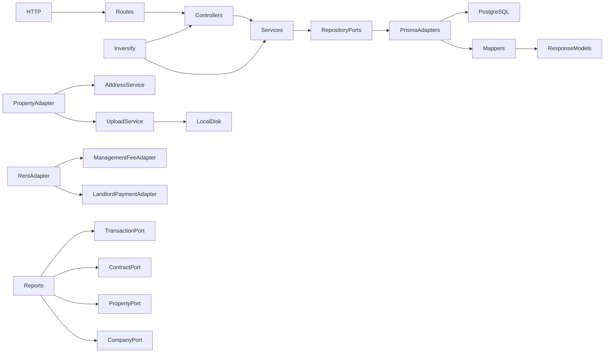
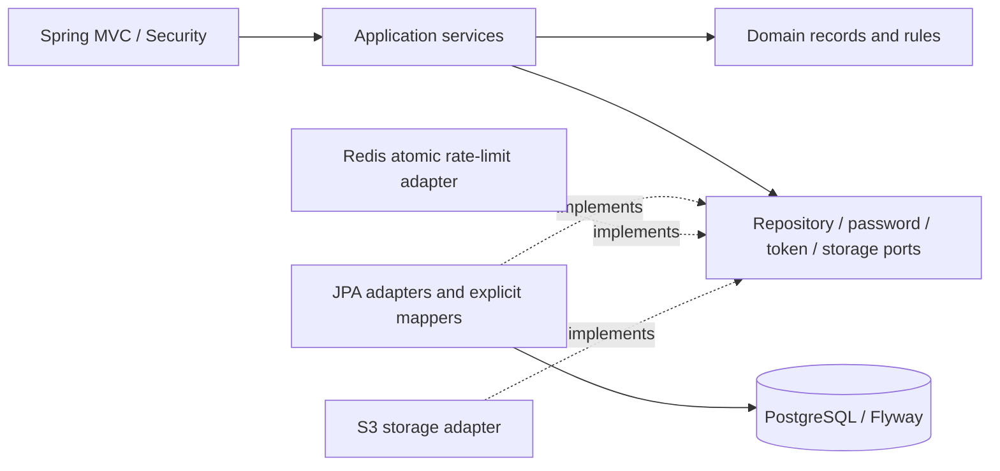

# Architecture migration: source assessment and target design

## Phase 1 — what the supplied backend actually does

The source is a single Express/TypeScript application with 14 feature directories, an Inversify composition root, abstract controller/service/repository classes, Zod input schemas, explicit Prisma-to-response mappers, PostgreSQL and local Multer storage. `src/app.ts` defines the mounted routes; the source routes take precedence over the old README. The test directory contains Faker seed data, not an automated test suite. PDFKit is declared but no report endpoint generates PDFs. There is no AWS, Redis, refresh-token store, device identification, password-change endpoint, rate-limit implementation, cache, metrics registry, CI pipeline or distributed session protocol to preserve.

The architectural intent is separation of orchestration and persistence. It is imperfect: domain abstractions import Express, Inversify and data-layer Zod models; property persistence calls application services; rent persistence performs business calculations. The Java target preserves the intent and removes those reversed dependencies.

### Request lifecycle and API invariants

Pino request logging → open CORS → JSON/form parsing (50 MB) → router → JWT middleware → role middleware → controller/Zod → service → Prisma → explicit mapper → success envelope. The error middleware maps exceptions into JSON. CRUD paths use `/create`, `/all`, `/single/{id}`, `/update/{id}`, `/delete/{id}`. Updates use PUT with partial semantics. Successful lists contain arrays. Identifiers are UUID-formatted strings stored as PostgreSQL TEXT. Responses predominantly use snake_case, while reports and some filter/body parameters use camelCase. Property creation/update accepts multipart fields and `images`. Owner queries derive the tenant/landlord ID from the authenticated user. Transactions filter by `propertyName` and repeated `types`.

### Security assessment

Login/register use bcrypt cost 8 and a 24-hour HS256 JWT containing the user ID. Middleware verifies the JWT then reloads the user. Roles are USER, ADMIN, TENANT and LANDLORD. Property list/detail are public; most management routes require ADMIN; owner property routes require their respective role. Dashboard accepts any authenticated user.

Problems identified in the supplied implementation:

* Public registration accepts ADMIN, enabling privilege escalation; registered TENANT/LANDLORD users do not get their required subtype row.
* Role middleware calls `next()` after forwarding a forbidden error. Inactive users are not rejected. Login distinguishes nonexistent users from wrong passwords.
* A general user mapper includes the password hash, and the admin single-user route can return it.
* Public property responses include landlord email and documents. Multer writes files before validation; its filter accepts everything. Local public storage and inconsistent MIME lists undermine upload controls.
* User/subtype creation and rent/fee/payment creation span separate commits. Refresh rotation and invalidation are missing entirely.
* Property update requires an omitted landlord ID and deletes existing images even on ordinary metadata updates. Address creation can omit required database fields. Property deletion can delete an address shared by another record.
* Rent update attempts to update fee/payment subtype rows through the rent transaction ID. Zero management fee suppresses landlord payment. Expense logic selects an unrelated payment and repeatedly subtracts the full amount on edits.
* Some transaction updates silently ignore date/month fields. Rent, property and tenant IDs are not checked for agreement. Date ranges and month values lack complete validation.
* Queries return unbounded arrays; reports load the full transaction table; monthly reports combine years. Description grouping splits on hyphens and loses text. The implemented VAT calculation is `vat = gross × 0.20`, `net = gross − vat`, irrespective of the contradictory source comment.
* The final Prisma migration drops and recreates role/type/status columns, losing their values. The Dockerfile references absent `prisma.config.ts`, expects ignored tests, and invokes an undeclared build dependency.

### Database model

The 17 tables are User, Tenant, Landlord, Property, Transaction, LandlordPaymentTransaction, ExpenseTransaction, ManagementFeeTransaction, TenancyContract, RentTransaction, Address, PropertyAddress, UserAddress, File, PropertyImage, PropertyDocument and CompanyDetails (17 tables total). Tenant/Landlord share a primary key with User. Four transaction subtype tables have unique `transaction_id`. Property and user address links support history through `current`. Foreign keys use ON DELETE/UPDATE CASCADE. Existing unique indexes cover email and transaction subtype identifiers; most foreign keys are unindexed. All timestamps are TIMESTAMP(3), roles/statuses are TEXT after the final migration, and financial columns are DOUBLE PRECISION, not Decimal.

## Phase 2 — target architecture and decisions

Java lives at the repository root. One Maven deployable contains packages by feature, with domain, application and infrastructure boundaries. Accounting subfeatures share the transactions aggregate because rent, fees and payments must commit together. Dependencies point toward application ports and framework-independent domain records/invariants. Explicit mappers separate persistent state from domain state and API output. No Lombok, MapStruct, reactive stack or speculative resilience framework is needed.

* Boot 4.1 / Framework 7 / Security 7 on Java 26; Spring MVC with synchronous use cases and virtual request threads. Jackson 3 is the Boot 4 JSON implementation. Framework transaction annotations are the deliberate application-layer exception to framework independence; domain code stays pure Java.
* Preserve table and column names and subtype relationships. A fresh Flyway baseline matches the final Prisma schema without replaying destructive historical migrations. A separate migration converts money to NUMERIC(19,2), percentages to NUMERIC(7,4), adds validation/indexes and new session/accounting state. Existing databases require an explicit audited baseline; no automatic baseline-on-migrate or schema update.
* Preserve successful envelopes and existing routes; add bounded paging without changing array-shaped list data. Explicit null on required patch fields is rejected; absent fields remain unchanged. Responses never serialize JPA entities or password hashes.
* Stateless bearer access tokens use Spring Security's Nimbus JWT primitives. Persisted, hashed, device-bound refresh tokens rotate under database locks. A token family tracks replay; password/security version checks invalidate access immediately. Logout revokes a family; global logout/password changes increment security version. New APIs supply missing behavior rather than claiming it existed previously.
* Registration can create USER only; administrative provisioning creates tenant/landlord accounts. First-admin provisioning is an explicit environment-driven bootstrap operation. Public property views redact landlord contact details and documents. CORS origins are configured; bearer tokens are never accepted as cookies, so CSRF is disabled for that explicit threat model.
* Redis Lua counters implement shared configurable policies, fail closed when unavailable, and never trust arbitrary forwarded client-IP headers. Authentication is limited by source and hashed account identifiers. Bound JSON/multipart input and return stable ProblemDetail errors with request IDs.
* Atomic rent operations link generated management/payment transactions to their source rent. Paid generated payments cannot be rewritten. Expenses remain distinct ledger entries instead of mutating an arbitrary payment. Report arithmetic retains the legacy VAT formula, documented as compatibility behavior rather than tax guidance; monthly reports select a year.
* Use private S3-compatible storage for durable multi-replica uploads, generated object keys, signature and extension checks, signed reads, rollback cleanup and durable deletion jobs. Local Compose supplies S3-compatible infrastructure. There was no AWS integration to copy; AWS SDK v2 solves the newly required durable-storage constraint.
* Actuator health/readiness/liveness and Prometheus metrics, JSON console logs with MDC, graceful shutdown, non-root container and CI verification. Unit tests cover invariants/calculations/security; PostgreSQL/Redis/S3 integration tests cover persistence and real HTTP workflows. Never substitute an in-memory database for PostgreSQL semantics.

### TypeScript → Java learning map

| TypeScript mechanism | Java equivalent | Why / concept to learn |
|---|---|---|
| Inversify injection | Constructor injection and Spring configuration | Dependencies are explicit and testable; learn interfaces and object composition. |
| Promise-based I/O | Synchronous methods on virtual request threads | JDBC is blocking; virtual threads avoid callback plumbing without changing transaction semantics. |
| Zod schemas | Request records, Jakarta validation and domain invariants | Separate transport shape from cross-record business rules. |
| Prisma model | JPA entity plus independent domain record | Persistence annotations describe storage, not business identity. |
| Prisma adapter function | Explicit persistence/API mapper | Learn controlled copying and why secrets must not cross API boundaries. |
| JavaScript number for money | BigDecimal with explicit scale and rounding | Decimal arithmetic avoids binary floating-point accounting drift. |
| Date | Instant and LocalDate with explicit UTC conversion | Distinguish an event timestamp from a calendar date. |
| undefined in partial update | Presence-aware command fields | Omission is different from explicit null; do not replace an entire aggregate accidentally. |
| Middleware | Servlet filters, Spring Security, controller advice | Each mechanism has an ordered request-lifecycle responsibility. |
| Multiple Prisma writes | One application `@Transactional` boundary | Learn atomicity, rollback and row-level locking. |
| Abstract repository class | Java repository interface with JPA adapter | Application code depends on a port, never JpaRepository. |
| Runtime string enum | Java enum plus database CHECK constraint | Compile-time type safety and storage validation agree. |
| Pino | SLF4J, Logback JSON and MDC | Structured logs and request correlation without secret payloads. |

Version references: [Boot 4 build modules](https://docs.spring.io/spring-boot/4.0/reference/using/build-systems.html), [Jackson 3](https://docs.spring.io/spring-boot/4.0/reference/features/json.html), [Java compatibility](https://docs.spring.io/spring-boot/system-requirements.html).
